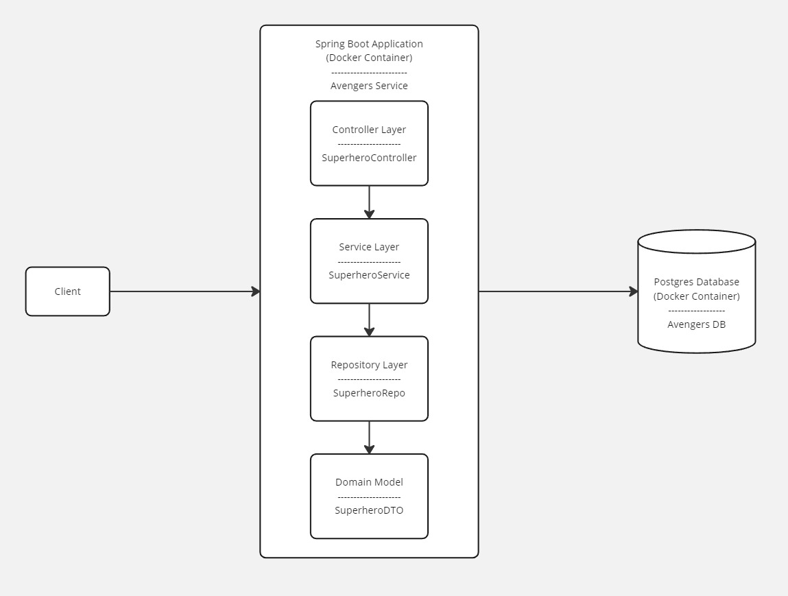

# The Avengers Superhero Management System

### Designed to manage superhero entities, built using JDK 17 and Spring Boot 3.3.0 and uses Postgres DB running in a docker container.



Endpoints:
1. POST /api/superheroes: This endpoint is used to create a new superhero. It accepts a JSON body representing the superhero to be created.  
2. GET /api/superheroes/{id}: This endpoint is used to retrieve a specific superhero by their ID.  
3. GET /api/superheroes: This endpoint is used to retrieve all superheroes. It supports pagination through the page query parameter.

### Requirements
- JDK 17
- Maven
- Docker Engine

### Running the application
1. Clone the repository
2. Run in root directory: 'mvn clean install'
3. Run in root directory: 'docker build -t avengers-service .'
4. Run in root directory: 'docker-compose up'

### Curl commands to test the api (Works well with Git Bash, or please use Postman)
1. Create a new superhero:
```
 curl -X POST --location 'http://localhost:8080/api/superheroes' \
--header 'Content-Type: application/json' \
--data '{
    "alias": "Hawkeye",
    "name": "Clint Barton",
    "powers": ["master-archer", "expert-marksman", "expert-tactician"],
    "weapons": ["bow-and-arrow", "trick-arrows", "sword"],
    "origin": "Trained as a circus performer, later recruited by SHIELD",
    "associations": ["avengers", "shield", "black-widow"]
}
'
```

2. Retrieve a specific superhero:
```
curl -X GET --location 'http://localhost:8080/api/superheroes/4' 
```

3. Retrieve all superheroes:
```
 curl -X GET --location 'http://localhost:8080/api/superheroes?page=1'
```

#### Thoughts:
1. Folder structuring: Every team has a preference for structuring their projects. Usually teams follow either Package by Layer or Package by Feature.
                       What our team follows is a mix of both what we call is Package by Component. This is a hybrid approach where we group classes by their functionality and then by their layer.
                       This helps in only exposing Service classes and some DTO's to the Controller and not the Repository classes or Entity classes. We believe this is a good practice as it helps in maintaining the code and also helps in testing.
                       This way we keep the Repository and Entity classes package-private, which also makes sure that no other Service class outside the domain can access them.
2. Testing: In this case, I have written only the integration tests using testcontainers. The service layer isn't doing much now, so didn't make sense to write unit test for it.
            Testcontainers makes sure all your Database queries will work as expected, since we use a database docker image (as close to the Production DB) for testing.
            By doing this, I have made sure that the test coverage is above 90%.